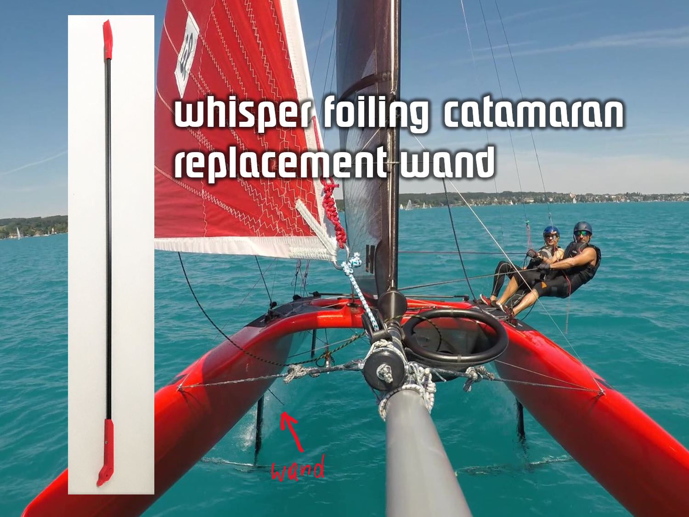
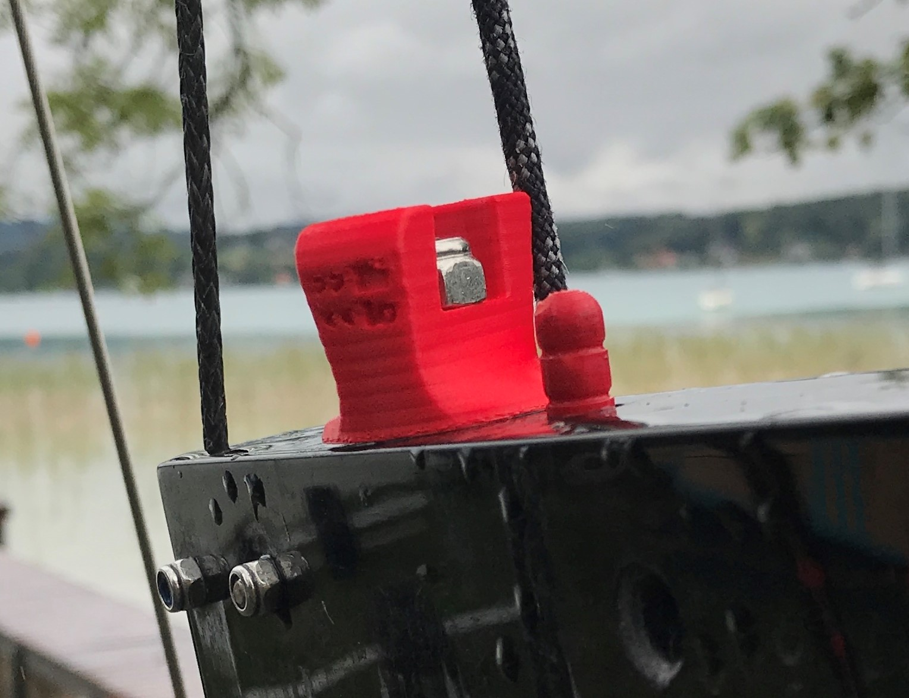
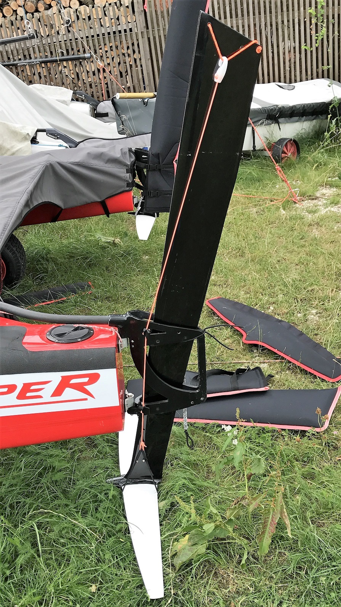
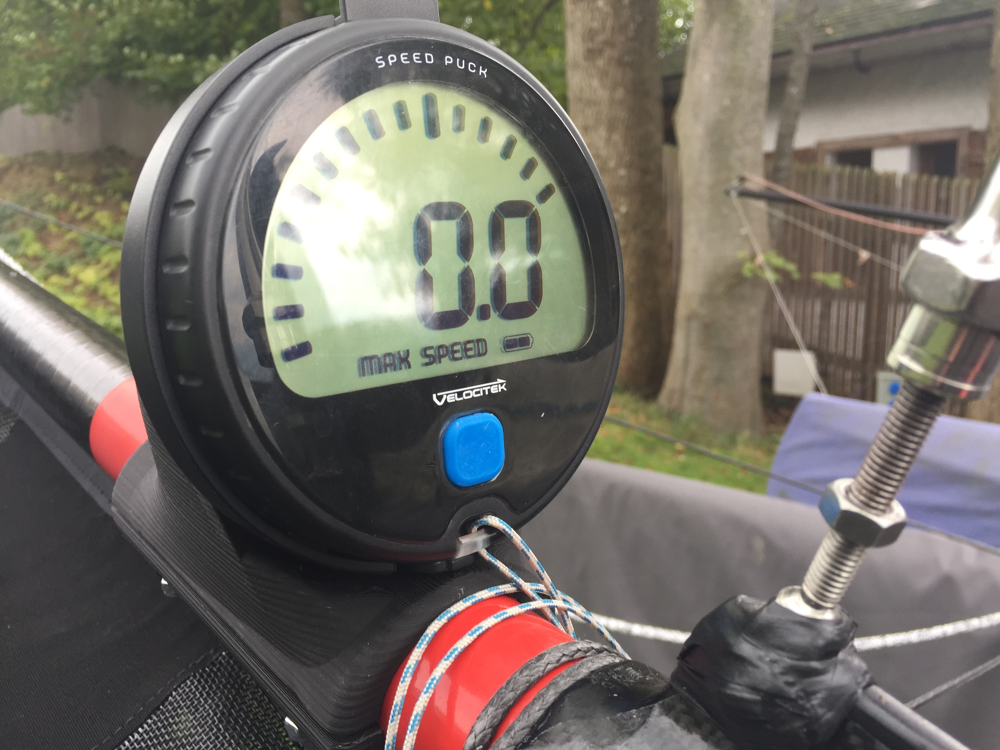
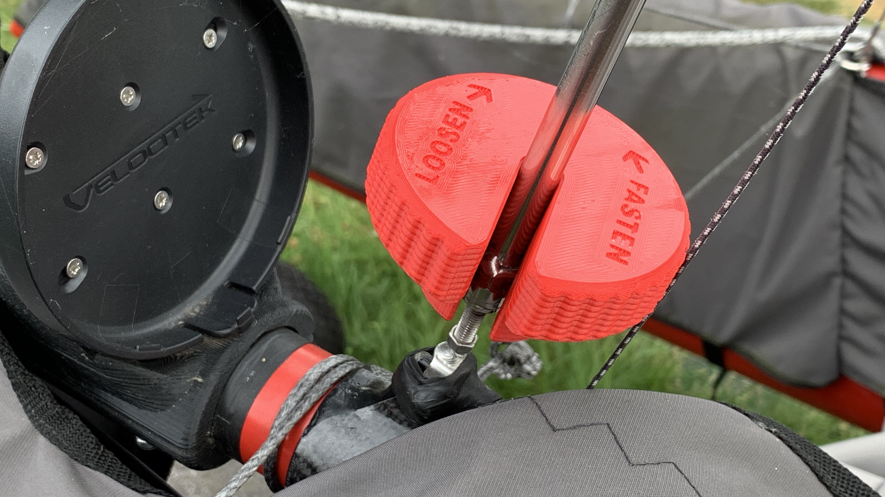
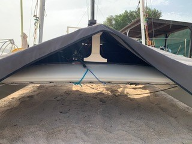

# Repairing and tuning the Whisper with 3D printed parts

* [__wand system__](#Wand-System) to replace parts that break with easier access as well as tunings
* [__ride height adjuster__](#Ride-Height-Adjuster) much easier than the rope, with up/down indicators
* [__rudder holder__](#Rudder-Holder) to lock in various heights in shallow waters
* [__speedpuck mount__](#Speedpuck-Mount)

community contributions:
* [__boom holder__](#Boom-Holder)

# Wand System
The [Whisper foiling catamaran](https://www.youtube.com/channel/UCwhb6u4A_Hy-c-eJbMLW7bg) uses "wands" as ride height sensor to dynamically control the foil lift. Parts of that wand system break from time to time, so printing them yourself can be convenient.

To produce an entire wand, you do need:
--------------------------------------------------------
* carbon rod (CFK) 8mm diameter, 1m length (you will need to cut it to 830mm length)

* 3D print paddle (lower end)
* 3D print arm (top part of wand)
* 2 stainless screws (3mm x 10mm or longer) -- you will clip to proper length anyway

Print material needs to be stronger than PLA, so I use e.g. ASA instead..

additional replacement parts related to the wand system:
--------------------------------
* lever inside of foil ride height mechanism
 

### Updates:
* 20180826: updated wand arm to mount the rod screw from the side
* 20200530: added wand paddle/skimmer model with screw mounting from aft
* 20200530: added wand paddle/skimmer model with screw mounting side - maybe thats the most convenient option for mounting. 
* 20200606: added wand arm version to mount the rod screw from aft, and another version to mount the screw from both sides, to make unmount/mounting easier. mechanically is the version from 2018 with one rod screw from side more robust.

## wand arm:
* use 8mm drill to create a snug fit of the rod into the 3D printed parts
* drill 5mm hole for the shock cord that pulls the arm back
* drill 4mm hole for the hinge
* drill 2.5mm holes for the metal connector, and cut a M3 3mm metric thread into it 
* drill a 2.5mm hole into the carbon rod for the 3mm screw (I use a HSS-cobalt drill for the Carbon rod)
* clip the screw to a length so it just doesnt stand out on the other side of the arm

## wand paddle:
* use 8mm drill to create a snug fit of the rod into the 3D printed parts
* drill a 2.5mm hole for the 3mm screw (I use a HSS-cobalt drill for the Carbon rod)
* clip the screw to a length so it just doesnt stand out on the other side of the paddle

## wand rod:
* total length of original wand including arm and paddle is 930mm
* cut the carbon rod to 830mm 

## wand ride height lever:
* drill 2.5mm holes for the 3mm screws (I use a HSS-cobalt drill for the Carbon rod)
* drill 2.5mm holes for the connecting rod
* cut M3 3mm metric thread into it -- you might use only 2 of three cutting tools, so that the fit of the screw is tighter
* a tiny bit of glue helps additionally to lock the screws, so they dont open accidentally 

## wand T part:

This is a replacement part for the Whisper foiling catamarans ride height T part. It is printed laid down so to benefit from increased strength vs. the original part. As a tradeoff, it needs to be printed with supports.

For enough strength, I recommend printing in FormFutura ASA (ApolloX) material, which is UV, warmth and water proof. 

## Lever Arms:
* drill 2.5mm holes for the 3mm screws
* cut M3 thread into 2.5mm holes (hint: using only 2 of three cutting tools, makes the fit for the screw tighter so it doesnt get lose as easily; a tiny bit of glue helps additionally to lock the screws)

## T-Part
This version does not use a metal thread insert as the original one does, but instead receives the threads directly in the plastic using an M8 thread-cutting tool. So please check out print settings below, as those are unusual yet important for robust threads.
* supports from bottom up only (no supports for the M8 hole needed)
* make sure its printed horizontally
* i recommend approx 2.8mm shell/roof/floor
* M8 thread cutter
* use a 9mm drill to just clean-out the 9mm hole for the arms

There is also a version with Stainless Helicoil metal insert. It do believe it is not required as printing ApolloX ASA in horizontal layers provides enough strenght. In case you still want the metal insert, you will need M8x1.25xD3 Helicoil kits like [this](https://www.amazon.com/Rocaris-Thread-M8-x1-25mm-Compatible-Repairing/dp/B07F18GHZG/ref=sr_1_6?keywords=helicoil+m8&qid=1573300343&sr=8-6) and long enough stainless helicoils. 

threads require enough material around them:
* shell: 2.8mm 
* roof: 2.8mm
* floor: 2.8mm

make sure to use robust infill patters. with the 3d octo pattern it works with 50%
* infill: 50% 

supports: 
* from build plate only
* when using dual-printing with water soluble material then FormFutura Helios (PVA) works best with ApolloX (ASA).

build plate: 
* temperature: 90 degrees
* adhesion: DimaFix applied to glass-plate

## 3D models
you can download from Fusion 360 site  in a format of your choice

* [wand paddle](https://a360.co/2O1Cxfj)
* [wand arm](https://a360.co/2wckjRI)
* [wand ride height lever](https://a360.co/2w9MqAS) 
* [T Part Fusion 360 CAD Model](https://a360.co/36usnOo)

# Ride Height Adjuster

The Whisper catamaran has a ride height adjuster, that is intended to be controlled with a 4mm rope. However, as I - and most Whisper users to my knowledge - dont use the rope but adjust the ride height manually, I figured lets make manual adjustment easier.

Hence here is the ride height adjuster that also has a little imprint to help with turning left means higher ride height and turning right means lower ride height. It replaces the original ride height wheel.

I printed with UV resistent ASA (FormFutura ApolloX) filament.

Here is the model [https://a360.co/2NASVn5](https://a360.co/2NASVn5)

# Rudder Holder

For coming in/out of shore in shallow waters, I needed a simple solution for keeping the rudder in middle position. One of the issues with my previous "door wedge" solution was that it failed when a wave or simply the foil-lift at speed pushed the rudder up. So the solution needed to keep the rudder in place - up and downwards. 
You need a 3mm rope, a simple plastic carabiner, a 5mm bungee.  

# Speedpuck Mount

This is v4 of a mount for the Velocitek Speedpuck on the Gennaker pole with 44mm diameter like on the whiteformula Whisper foiling catamaran. Its designed to ensure that sheets dont tangle up. v4 stl files are printed 30% lighter in weight, yet more robust when printed with hexagonal infill. also the 5mm screes fit now easier.

You print 2 pieces:
* the main mount (upper part)
* the clamp (lower part)

You need
* 6x 15-20mm stainless wood screws (max 3mm diameter, better 2.5mm)
* 4x 30mm M4 Hex bolts and Nyloc nuts - stainless

Just for reference:
* v1 is here http://www.thingiverse.com/thing:1465245
* v2 is here designed for 38mm pole diameter http://www.thingiverse.com/thing:1644998

here is the Fusion 360 design:
[http://a360.co/2dl8z6m](http://a360.co/2dl8z6m) 

# Rig Tension Adjuster

As the Whisper catamaran rig should be tightened for every ride (and loosened thereafter) it is a bit tedious to use a wrench. Thus is designed this turning knob that can be used by hand. 

To make it a bit more robust I printed with ASA (UV and water resistant, as well as good mechanical properties --- I used FormFutura ApolloX) and apply at least 5 walls.

Fusion Design: [https://a360.co/2YBYY0c](https://a360.co/2YBYY0c)

# Boom Holder
Contributed by [Christian Witsch](https://www.youtube.com/channel/UChSlq1hUahmVQtAV6N_KJtA)

# License
All models are licensed under __Creative Commons - Attribution - Non Commercial - Share Alike__