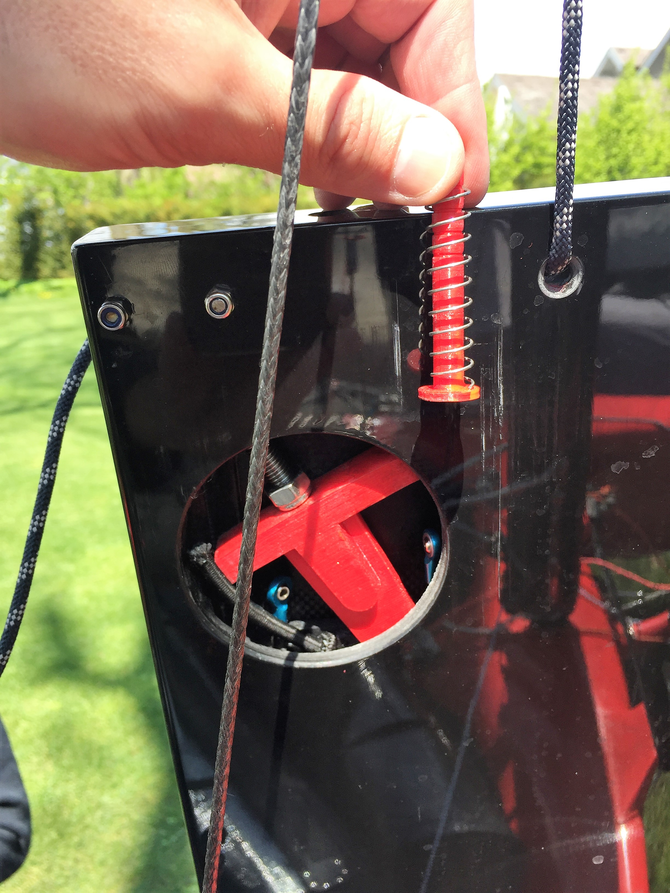
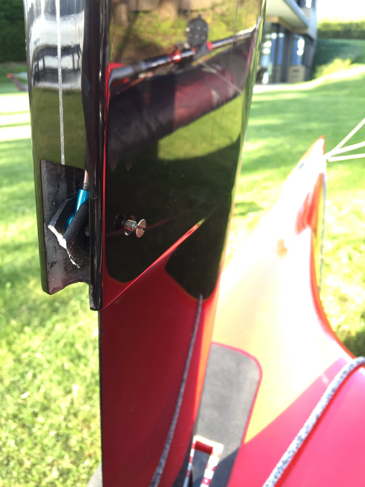

# whisper catamaran sailing experiences

[YouTube videos](https://www.youtube.com/channel/UCwhb6u4A_Hy-c-eJbMLW7bg)

# rigging and trimming tips
## main sail 
O-shackle should be placed in a way that the knot shows towards the mast. This is needed so that the main halyard unhooks easily when rotating the mast 90 degrees.

## foils
Flaps should show 2-3mm upwards when the wands are down.

## Fastest sailing when sail is above one
Async setup of flight height through ride-height adjuster wheel and through foil rake, like 2.5 windwards and 3.5 leewards. 

Foil rake: 4 is absolute max. 2.5 to 3.5 is good.

Whiteformula hints: Straight line speed is best upright, but sailing for an upwind mark is best at 15degrees over to windward, this way you will generate lift towards the mark. 
There is no need to adjust the ride-heigth with every tack to achieve the 15 degree angle, just async foil rake and balancing the boat with main sheet should do it. 

## Tacking
I found tacking actually quite tricky with the Whisper vs the Nacra F16. The Whisper barely turns through the wind.
When sailing alone, I keep my weight as far back as possible to turn the bow through the wind. If that doesnt work, whats common, I push the main sail by hand into the wind so the boat gets additional turning momentum.
When sailing with crew, the crew back-winds the jib. However, even this didnt allow for quick tacking. 

The quickes tacking so far is a __semi-foiling tack__. So while on the foils the helm and crew move from trapeze onto the boat. It just needs a little losening the main-sheet and the whisper remains remarkable stable. So then its all about speed of unhooking the trapeze, and turning the boat into the wind while still on the foils. So far we managed twice to turn the boat through the wind. But by then we lost too much speed and went gently off the foils. However, we did the tack in the so far speediest form I know of.  

# boat tweaks

## chicken line
So far all of the capsizes and most of the splashes were related to losing balance on the boat. While I hope to get better at keeping balance and steering the boat smoother, I still need to be able to hold-on to something. The traveller line isnt ideal, as the traveller cleat opens to easily and when the traveller is a bit out, you pull the sale all the time. On my Nacra 16 I had a chicken-line, which saved me a couple of times from capsizing when sailing gennaker downwind. So here is my first implementation of a chicken line for the whisper. Its good, it works, and it could be further improved too.

I will try [Martin Langhoffs solution](https://www.youtube.com/watch?v=p0dYLhHZWO4) next.

## hull lid marks
Trying to be a "good customer" I followed the advice to untighten the hull-lids - just a little bit by a half turn - so that the hull can equalize air pressure. However, on my third sail with this boat ever, I didnt notize during the pre-sail check that I forgot to tighen it. The lids were on, but just not tight. During a later capsize I lost then one of the hull-lids and flooded one hull with water. The Whisper almost sank and needed some rescue help. So to avoid this from happening ever again, I put a marker on the hull lid, so one can easily see whether its tight or not.

## 4-wheel trolley
So I do need a 4-wheel trolley to slip the whisper. The air-filled wheels swim nicely. But also they swim nicely, so risking to damage the foils when sliding the boat onto the trolley. So the best fix for this was to fill the rear wheels to almost 100% with liquid. The front wheels got only 50% liquid, so they would still swim, making it easier to keep it in contact with the hulls. I found from the camping area ecological frost proof liquid that is used for camping cars. It felt I filled the old airpump 1000x with that liquid and pressed it into the tyre. But it worked.    

## slipping line
I do slip boats with a winch. I found the best way to pull the Whisper is a dyneema line from the gennaker shackles on each side of the boat. I put a "cleanup" expansion cord in there so its not loose during sailing. 

## sacrificial halyard - no longer
At the very first day with the Whisper we lost the jib halyard twice, requiring to pull down the mast. Also I wanted to minimize the amount of work to (de-)rig the Jib.
My solution for this is to have:
* 1.8mm line, about 2m longer than the original sacrificial halyard.  
* tied on one end to the halyard eye
* tied on the other end to my abovementioned slipping line
So when hoisting the Jib, everything stays tied. I simply flake the new (non-)sacrificial halyard and stow it in the trampoline bag. Again, with all knots in place.

Picture shows the (non-)sacrificial halyard tied with a mini-carabiner (not required) to the slip line. 

## rigging tension 
Tightening and loosening the rig at the stainless striker with the spanner wrench is somewhat annoying. 
I am a lazy person - in the sense of repetitive tasks - and hence want to automate everything as much as possible.
So I have ordered a 17mm spanner ratchet and let you know how much of a help it is.

The Whisper manual says it should be 17 Loos gauge rigging tension. I justs bought a more modern spinlock from rig-sense. There is a conversion table to loos so my mast support rig with 120kg / 21loos should be fine.

Here are some measurements of status quo measurements. I am interested in the appropriate target settings...
| Line | Tension in kg | Loos gauge (approx.) | comment |
|------|---------------|----------------------|---------|
| Mast support | 120kg | ~21   | measured below spi pole |
| Mast support / rig tension | tbd | tbd   | measured under trampoline (V-wire) - recommendations seem to be 17 absolute min, 20 light winds, 25 heavier winds on Loos gauge |
| Diamond      | 60kg  | ~12   |
| Shrouds      | 80kg  | ~17   |
| Jib          | 70kg  | ~15   | measured above stainless striker |

### mast safety line
In order to avoid the mast falling accidentally when untightening the rigging tension at the stainless striker, I put a short piece of dyneema rope there. I am lazy and thats more convenient than tying the spinnaker halyard back and forth to secure the mast.

## ride-height adjuster
I got my stunning looking new black foils and opened the sailing season with them. During one of the first sails I discovered that the ride-height adjustment wheel got looser the more I turned it back and forth. I was worried the mechanics fall apart while on water. So I aborted the sail and took the ride-height system on land apart. The issue was the the **nut on the threaded rod was loose** (see picture below the not on top of the red T). 
I checked the position of the nut so that the 3D-printed wheel would fit nicely, marked the position, and put then __threadlocker glue__ on it to make sure it wouldnt move again. So far it works well. 

## righting line
Yes, it costs a few grams, but its less stressful if you have a righting line that you can pull out of the pocket vs. making knots into the gennaker sheet for uprighting. The other benefit is that the crew can use it to hold on when the helm is working the main sheet. 

## main sheet pulley

### 1) two-handed
There is quite some force on your hands when constantly operating the main sheet to balancing the boat on the foils. So I ordered 40mm Harken blocks that allow for a 6:1 translation vs. default 4:1. I also ordered a variable thickness main sheet and need to splice it on the block properly so to not destroy the original pulley. I will let you know how it goes.

### 2) single-handed
There are two issues making single-handed sailing more difficult. 
* One is that the main-sheet location at the boom,pulls you forward, which makes it hard to balance when you are already hiking at the very end of the boat. 
* Second, managing the gennaker sheet, main sheet and tiller all at once is one thing too much. At the Nacra i could cleat the main sheet while hiking and operating the gennaker.

So the idea is to solve both items with a set of following Harken blocks. I had to take the larger 57mm blocks because the cleats that fit the original block size would only handle 6mm lines, what is too tight for main sheets.

Yet to be tested.
 
## gps
Having the only whisper at this lake is cool, yet suffers from the ability to match-race. So I need to know the speed on the go, to get a better sense what works. So far my conclusion is that proper boat balance has more impact than sail trim of jib sheet, mast rotation, cunningham. However, I am sure I still need to learn a lot.
So I mounted a Velocitek SpeedPuck. 

The holder is 3D printed and can be found here [https://www.thingiverse.com/thing:1814601](https://www.thingiverse.com/thing:1814601).  

## rudder holder
Launching the boat in shallow water requires to hold the rudder in position by hand. When sailing single-handed its impossible to pull the boat at the bow through the water and hold the rudder at the far distant end of the boat at the same time. so something needed to keep the rudder a quarter-height down. I had this door wedge at home, and squeeze this at the side of the rudder to keep it at height. This works ok, when pulling the boat, but as soon as you are on the boat and pick up speed, it falls off as the rudder gets lift. Yes, if you manage to better adjust the angle of the rudder so the force goes down, maybe its possible to better keep it in place. However, I had to dive for the wedge already and since added a line to it.

However, it works only when there are no waves. Waves push the rudder up/down and the wedge falls immediately off. Has anyone a better solution?

As alternative I am thinking about a rope from the T of the foil to keep it up, and another rope from top of foil to keep it down. Maybe 3D print a little piece that makes that easy. So the work on a boat never ends...

## how to remove water from the mast
The mast should be water tight. But however, in my unfortunate case when I lost the lid of the hull and the boat almost sank, I did get water into it. The entire mast was in the water and it could have gottin in at the foot or somewhere else on the mast. Usually when capsizing the foot is above water, so less risky for untighteness.

However, in case you have water in the mast, I had gotten from whiteformula's Tom White great hints. To get it out you can remove the screw from the halyard turning block eye. Near the base of the mast. This should let out any water. Note, the smaller upper-one screw of the two is connected with the hollow area of the mast, so this one lets water come out. 

If this does not solve the problem it is most likely that one of the rivet plugs is leaky. You can remove the white plastic plugs in the rivets on the mast hook. You can either pull them out with a pin or you can remove them with a 2.5mm Drill bit. I got some plugs from the nice guys from whiteformula.

 
A very easy way to find the leak is to put soapy water over all of the rivets and blow air into the mast through the halyard eye hole using a bike pump. You will see bubbles come from the rivet that is leaky.
 
If it is not a rivet but a screw in the foot, you can remove the screw, put a little silicone in the hole and then put the screw back in. That should solve it.

# some stories...

## swimming for screw-driver
It is not the worst, but still this is what you don't want to happen. Especially when single-handed sailing you are toast. 

So recently we went out, had a great sail. When approaching the shore and stopped to prepare for slipping we couldnt lift the backboard foil anymore. We double-checked the boat speed, but it was zero. So was the wand blocked by a branch or so? Nothing there that we could identify from the trampoline of the boat. Big problem, because it means we cannot pull the boat to the shore due to shallow knee-deep water. 
So we tied the bow to a closeby buoy and I jumped into the 14 degree celcius warm (!) water perform a closer inspection. Then i could feel it with the fingers. There was something on the back side of the foil preventing to lift it. Swimming to the inside of the hull and diving  the head underwater I could see that the screw was loose. Since I usually don't bring my tool-chest on-board flying, I had to take a swim and get a screw driver.Screw tightend and the foil went up again. Phew. Somehow at the end I broke the wand. How that happened is unclear to me. It just broke by a simple touch. Maybe the wand was already damaged during the ride by only being half mounted.

So the boat and crew was rescued and we could slip the boat on land. Gladly I had ordered spare wands with the boat so I was on to fixing that broken one. It was trickier than I thought. The connecting metal axle had to be unscrewed at the top of the foil as well as at the wand. When I had finally the new wand in position, I figured the 3mm screw wouldnt go in. Why? There were no threads. So fortunately I had 3mm thread cutting bits. They come as a set of 3 and I used only the first two, so that the threads would be tight enough and keep the screw in place.

As to the larger screw that I almost lost during sailing, I used silicone glue, which should allow me to open the screw again in the unpleasent event i crack the wand again.  
